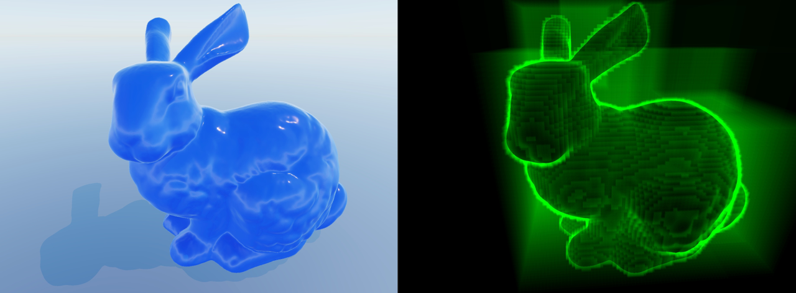

# PicoVDB

Compact sparse volumetric data format optimized for WebGPU real-time rendering.



**[Live Demo →](https://emcfarlane.github.io/picovdb/demo/)**

> [!WARNING]
> This project is under active development. The data format and API are subject to change.

## Overview

- **50%+ smaller volumes** than NanoVDB ([bunny](http://graphics.stanford.edu/data/3Dscanrep/): 64MB → 28MB)
- **WebGPU-native** data layout with WGSL shader library
- **32-bit addressing** for better GPU compatibility
- **Fast traversal** with hierarchical raymarching (HDDA)

This repository includes:
- `wgsl/picovdb.wgsl` - WGSL shader library
- `ts/picovdb.ts` - TypeScript loader
- `ts/model.ts` - GPU modelling API: primitives, booleans, offset, file in/out
- `src/main.zig` - NanoVDB → PicoVDB converter
- `src/stl.zig`, `src/mesh_to_grid.zig` - STL mesh → PicoVDB level set voxelizer

## How It Works

PicoVDB compresses NanoVDB files through:
- **Rank query compression**: Bit masks + counts eliminate inactive voxel storage
- **32-bit offsets**: Replace 64-bit pointers with computed indices (limits to 4 billion active voxels)
- **GPU-aligned structs**: Minimize padding, maximize cache efficiency

## Usage

```wgsl
// Include the library in your compute shader
// (concatenate picovdb.wgsl with your shader code)

@group(0) @binding(2) var<storage> picovdb_grids: array<PicoVDBGrid>;
@group(0) @binding(3) var<storage> picovdb_roots: array<PicoVDBRoot>;
@group(0) @binding(4) var<storage> picovdb_uppers: array<PicoVDBUpper>;
@group(0) @binding(5) var<storage> picovdb_lowers: array<PicoVDBLower>;
@group(0) @binding(6) var<storage> picovdb_leaves: array<PicoVDBLeaf>;
@group(0) @binding(7) var<storage> picovdb_buffer: array<u32>;

@compute @workgroup_size(16, 16)
fn main(@builtin(global_invocation_id) global_id: vec3u) {
    let grid = picovdb_grids[0];

    // Initialize read accessor
    var accessor: PicoVDBReadAccessor;
    picovdbReadAccessorInit(&accessor);

    // Sample voxel data using HDDA traversal
    var hit_t: f32;
    var hit_value: f32;
    let hit = picovdbHDDAZeroCrossing(
        &accessor, grid, ray_origin, t_near, ray_direction, t_far, &hit_t, &hit_value
    );
}
```

## Modelling

Grids can be edited with Constructive Solid Geometry (CSG). Modelling
operations (`Op`) apply to a `Solid` within a `Space`. Build solids from
primitives, then union, intersect, subtract, or offset them. See
`ts/model.ts` for the API.

```ts
import { Space } from '@emcfarlane/picovdb/model';

const space = new Space(device, { halfWidth: 3 });

// A bolt: a ball and a cylinder with a slot cut out.
using bolt = await space.sphere([0, 0, 0], 20)
  .union(space.cylinder([0, -30, 0], [0, 30, 0], 6))
  .subtract({ kind: 'box', center: [0, 0, 0], half: [30, 4, 4] });

// A hollow bunny: grow by two voxels, subtract the original, and move it.
using bunny = space.fromPvdb(await (await fetch('bunny.pvdb')).arrayBuffer());
using shell = await bunny.offset(2).subtract(bunny).translate([0, 0, -10]);

const bytes = await shell.toPvdb();
```

**Try it in the demo.** The [live demo](https://emcfarlane.github.io/picovdb/demo/)
exposes `space` and `scene.solid` in the browser console. `scene.solid`
is the loaded model. Assign a solid or an op to render it. This hollows
the model and cuts away the half facing the camera, so the shell shows:

```js
scene.solid = scene.solid.offset(2).subtract(scene.solid).subtract({ kind: 'box', center: [4000, 0, 0], half: [4000, 4000, 4000] });
```

## Converting Files
```bash
# Build converter
zig build

# Convert NanoVDB to PicoVDB
./zig-out/bin/picovdb convert input.nvdb output.pvdb

# Voxelize an STL mesh directly to a PicoVDB level set (no OpenVDB required).
# --voxel is the voxel size in mesh units; repeatable --rotate-x|y|z flags
# apply in command-line order (e.g. -90 about X re-orients Z-up meshes to Y-up).
./zig-out/bin/picovdb mesh --voxel 0.05 --rotate-x -90 input.stl output.pvdb
```

## Related Projects

- **[OpenVDB](https://github.com/AcademySoftwareFoundation/openvdb)** - Industry standard sparse volume library
- **[NanoVDB](https://developer.nvidia.com/nanovdb)** - GPU-optimized sparse volumes
- **[WebGPU NanoVDB](https://github.com/emcfarlane/webgpu-nanovdb)** - WebGPU port of NanoVDB
